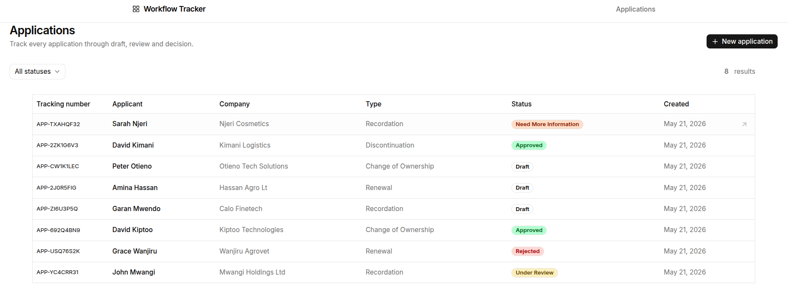
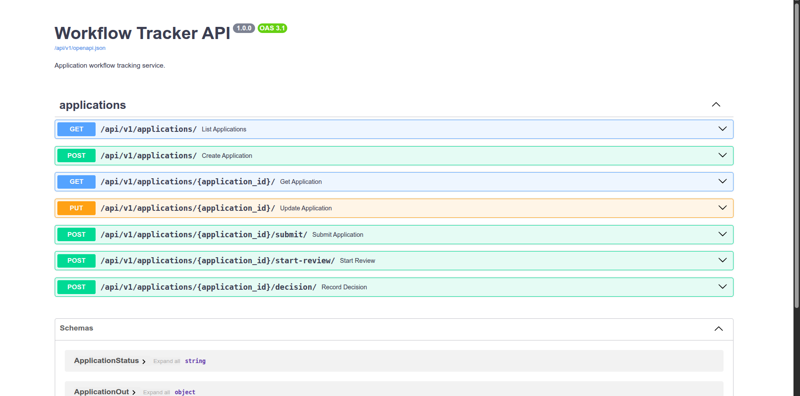
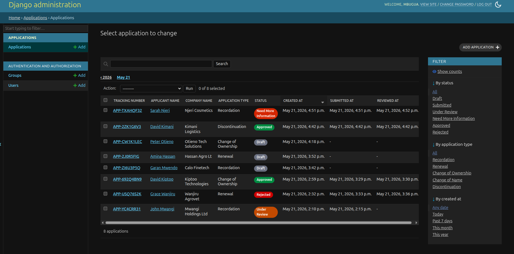

# Workflow Tracker

**Developer:** Patrick Mbugua Kaveke  
**Email:** pkaveks2@gmail.com

---

A small, production-shaped application workflow tracker.

- **Backend**: Django 6 + Django Ninja, SQLite (dev), service layer isolates all business logic.
- **Frontend**: Next.js 16 (App Router), TypeScript (strict), Tailwind v4, ShadCN-pattern UI primitives, Lucide icons, React 19.
- **Deployment**: Docker Compose for containerised runs; Makefile for common operations.

The workflow:

```
Draft → Submitted → Under Review → { Need More Information, Approved, Rejected }
```

`Need More Information` loops back: the applicant edits and resubmits, re-entering `Submitted`.

---

## 1) Screenshots

### i. Frontend — Application list (homepage)



### ii. Backend — API docs (Swagger UI)



### iii. Backend — Django admin panel



---

## 2) Prerequisites

| Tool                    | Minimum version |
| ----------------------- | --------------- |
| Python                  | 3.11            |
| Node.js                 | 20 LTS          |
| npm                     | 9               |
| Docker + Docker Compose | 24 / v2         |

---

## 3. Clone the project

### i) ssh githhub connection

```sh
git clone git@github.com:Kaveks/workflow-tracker.git workflow-tracker
cd workflow-tracker
```

### ii) HTTp github connection

```sh
git clone https://github.com/Kaveks/workflow-tracker.git
cd workflow-tracker
```

## 4. Local development (without Docker)

### a) Backend setup

##### i) Create and activate a virtual environment

**Linux / macOS**

```sh
cd backend
python3 -m venv .venv
source .venv/bin/activate
```

**Windows (PowerShell)**

```sh
cd backend
python -m venv .venv
.venv\Scripts\Activate.ps1
```

##### ii) Install dependencies

**Linux / macOS**

```sh
pip3 install -r requirements.txt
```

**Windows**

```sh
pip install -r requirements.txt
```

#### iii) Create the environment file

**Linux / macOS**

```sh
touch .env
```

**Windows (PowerShell)**

```sh
New-Item -ItemType File .env
```

Open `.env` and add the following (replace `<SECRET_KEY>` with the value generated in the next step):

```sh
SECRET_KEY=<SECRET_KEY>
DEBUG=True
ALLOWED_HOSTS=localhost,127.0.0.1
CORS_ALLOWED_ORIGINS=http://localhost:3000,http://127.0.0.1:3000
CSRF_TRUSTED_ORIGINS=http://localhost:3000,http://127.0.0.1:3000
```

#### iv) Generate a SECRET_KEY

Run the included generator from inside the `backend/` directory:

**Linux / macOS**

```sh
python3 applications/utils/django_secrete.py
```

**Windows**

```sh
python applications\utils\django_secrete.py
```

Copy the printed key and paste it as the value of `SECRET_KEY` in `.env`.

---

#### vi) Apply migrations and runserver

#### Local — Linux / macOS

```sh
python3 manage.py makemigrations && python3 manage.py migrate
python3 manage.py runserver
```

#### Local — Windows

```sh
python manage.py makemigrations && python3 manage.py migrate
python manage.py runserver
```

The API is available at `http://localhost:8000/api/v1/`.  
Interactive Swagger docs are at `http://localhost:8000/api/v1/docs`.

### b) Frontend setup

Open a **new terminal** and run:

```sh
cd frontend
```

#### i) Create the environment file

**Linux / macOS**

```sh
touch .env.local
```

**Windows (PowerShell)**

```sh
New-Item -ItemType File .env.local
```

Open `.env.local` and add:

```sh
# Browser (client-side) — always localhost so the user's browser can reach the backend.
NEXT_PUBLIC_API_BASE_URL=http://localhost:8000/api/v1

# Server-side only (SSR / server components running inside Docker).
# Uses the Docker-internal service name; ignored by the browser.
API_BASE_URL=http://backend:8000/api/v1

# Docker runtime flag.
# docker-compose.yml overrides this to "true" for containerised runs.
IS_DOCKER=false
```

#### ii) Install dependencies and start the dev server

```sh
npm install
npm run dev
```

The app is at `http://localhost:3000`.

---

## 5) Running tests (local)

From inside the `backend/` directory with the virtual environment active:

**Linux / macOS**

```sh
python3 manage.py test
```

**Windows**

```sh
python manage.py test
```

---

## 6) Quick start (Docker)

> Requires Docker and Docker Compose v2. The `env_file` entries below assume
> `backend/.env` and `frontend/.env.local` already exist (see steps 4a(iii) and 4b(i) above).

> Make sure you are on the folder "workflow-tracker" when running makefile.

> Note! no need of making migrations manually because the dockerfile does the job for you,

```sh
# Build images
make build

# Start the stack (detached)
make up

# Open the app
open http://localhost:3000              # frontend
open http://localhost:8000/api/v1/docs  # backend interactive docs

# Tail logs
make logs

# Restart
make restart

# Stop (keeps the SQLite volume)
make down

# Full tear-down — removes containers, volumes and locally built images
make clean
```

Migrations run automatically on backend container start. SQLite is persisted
in a named Docker volume and survives restarts until `make clean` is run.

### i) Docker env files

The Compose file reads environment variables directly from the local `.env` files:

| Service  | File                    |
| -------- | ----------------------- |
| backend  | `./backend/.env`        |
| frontend | `./frontend/.env.local` |

No environment variables are hardcoded in `docker-compose.yml`.

### ii)Available Make targets

```sh
make help             # list all targets
make build            # build Docker images
make up               # start stack in background
make down             # stop stack (volume kept)
make logs             # tail all service logs
make restart          # down + up
make clean            # full tear-down including volume
make test             # run backend tests inside container
make makemigrations   # generate migration files from model changes
make migrate          # apply migrations to the database
make createsuperuser  # create a Django admin superuser (interactive)
make backend-shell    # open shell in backend container
```

---

## 7) Django admin panel

The admin panel is available at `http://localhost:8000/admin/` and requires a
superuser account.

### a) Create a superuser (Docker)

The stack must be running (`make up`) before you create a superuser.

```sh
make createsuperuser
```

You will be prompted interactively:

```
Username: admin
Email address: admin@example.com
Password:
Password (again):
Superuser created successfully.
```

### b) Create a superuser (local — no Docker)

From inside the `backend/` directory with the virtual environment active:

**Linux / macOS**

```sh
python3 manage.py createsuperuser
```

**Windows**

```sh
python manage.py createsuperuser
```

### Access the admin panel

1. Open `http://localhost:8000/admin/`
2. Log in with the username and password you just created.
3. From the admin panel you can view, edit, and delete `Application` records directly.

---

## Project structure

```
workflow-tracker/
├── backend/
│   ├── manage.py
│   ├── requirements.txt
│   ├── Dockerfile
│   ├── .env                              # local secrets — never commit real keys
│   ├── scripts/
│   │   ├── build.sh
│   │   ├── run.sh
│   │   └── drop.sh
│   ├── core/                             # Django project (settings, urls, wsgi, asgi)
│   └── applications/
│       ├── models.py                     # Application model + enums
│       ├── schemas.py                    # Ninja input/output schemas (Pydantic)
│       ├── services.py                   # Workflow state machine — all business logic
│       ├── api.py                        # Thin HTTP endpoints
│       ├── tests.py
│       └── utils/
│           └── django_secrete.py         # SECRET_KEY generator
├── frontend/
│   ├── package.json
│   ├── Dockerfile
│   ├── .env.local
│   ├── app/                              # Next.js App Router pages
│   │   ├── page.tsx                      # List view
│   │   ├── new/page.tsx                  # Create draft
│   │   └── [id]/
│   │       ├── page.tsx                  # Detail view
│   │       ├── edit/page.tsx             # Edit draft
│   │       └── review/page.tsx           # Reviewer decision
│   ├── api/                              # Typed fetch wrappers (no UI concerns)
│   ├── components/
│   │   ├── ui/                           # ShadCN-pattern primitives
│   │   └── applications/                 # Application-specific composites
│   ├── features/applications/            # Action-permission helpers
│   ├── constants/                        # Enum labels and display maps
│   └── types/                            # Shared TypeScript types
├── docs/
│   └── frontend-schema-planning.md       # Source of truth for entity design
├── docker-compose.yml
└── Makefile
```

---

## API reference

Base path: `/api/v1`

| Method | Path                               | Body                 | Response              | Purpose                 |
| ------ | ---------------------------------- | -------------------- | --------------------- | ----------------------- |
| `GET`  | `/applications/?status=&search=`   | —                    | `Application[]`       | List; optional filters. |
| `POST` | `/applications/`                   | `ApplicationDraftIn` | `201 Application`     | Create draft.           |
| `GET`  | `/applications/{id}/`              | —                    | `Application`         | Detail.                 |
| `PUT`  | `/applications/{id}/`              | `ApplicationDraftIn` | `Application` / `409` | Update draft.           |
| `POST` | `/applications/{id}/submit/`       | —                    | `Application` / `409` | Submit.                 |
| `POST` | `/applications/{id}/start-review/` | —                    | `Application` / `409` | Begin review.           |
| `POST` | `/applications/{id}/decision/`     | `ReviewerDecisionIn` | `Application` / `409` | Record decision.        |
| `GET`  | `/health/`                         | —                    | `{"status":"ok"}`     | Health probe.           |

Workflow violations return `HTTP 409` with `{ "detail": "<human-readable reason>" }`.  
Interactive Swagger UI: `http://localhost:8000/api/v1/docs`.

---

## Architectural notes

### Backend: service layer over the API

`applications/api.py` is intentionally thin: parse → call service → serialise.
All workflow rules live in `applications/services.py`:

- Only `draft` or `need_more_information` applications can be edited.
- Rejection and `need_more_information` decisions require a non-empty reviewer comment.
- `start_review` is only allowed from `submitted`.

The HTTP layer catches `WorkflowError` and returns 409. This keeps rules unit-testable
without the HTTP stack and reusable by background jobs or admin commands.

### Frontend: server components first, client islands where needed

Pages (list, detail, edit, review) are server components that fetch data server-side
and stream HTML. Interactive pieces — forms, action buttons, decision picker, status
filter — are narrow client components.

`features/applications/actions.ts` mirrors the workflow rules to decide which buttons
to render. The backend remains authoritative: a stale state surfaces the 409 message
verbatim to the user.

### Schema discipline

`docs/frontend-schema-planning.md` is updated **before** any backend change. It documents
entities, fields, validation, the state machine, endpoints, and scalability notes.
Backend shape follows frontend need, not the reverse.

---

## Assumptions

| Assumption                                | Rationale                                       | Path to production                                                                                                               |
| ----------------------------------------- | ----------------------------------------------- | -------------------------------------------------------------------------------------------------------------------------------- |
| **No authentication**                     | Brief did not require it.                       | Add `User` model, JWT or session auth, reviewer role; the service layer already isolates the guard points.                       |
| **SQLite**                                | Zero-config for development.                    | Change `DATABASES` to PostgreSQL via `DATABASE_URL`; run `makemigrations --check` to verify no schema delta.                     |
| **No pagination** on list                 | Dataset fits in one page at assessment scale.   | Add `?page=&page_size=` params to `list_applications`; non-breaking since params are additive.                                   |
| **No file attachments**                   | Out of scope for v1.                            | Add an `Attachment` model (FK to `Application`), a `POST /applications/{id}/attachments/` endpoint, and object storage (S3/GCS). |
| **Tracking numbers via `secrets.choice`** | Collision probability negligible at this scale. | A unique index is already in place; add a retry loop on `IntegrityError` for high-volume environments.                           |
| **`next dev` in Docker**                  | Simplifies the inner dev loop.                  | Multi-stage Dockerfile: `builder` runs `next build`; `runner` copies `.next/` and runs `next start`.                             |
| **`runserver` in the backend container**  | Django's dev server is fine for review.         | Replace with `gunicorn core.wsgi:application --bind 0.0.0.0:8000 --workers 4`.                                                   |

---

## What I would improve with more time

1. **Authentication and roles** — distinguish applicants from reviewers; restrict
   `start-review` and `decision` to users with the `reviewer` role (JWT or Django sessions).

2. **Audit trail** — an `ApplicationEvent` table (actor, from_status, to_status, comment,
   timestamp) displayed as a timeline on the detail view. `submitted_at` and `reviewed_at`
   provide partial history today.

3. **PostgreSQL in Docker Compose** — parameterise `DATABASES` via `DATABASE_URL`
   (using `dj-database-url`); add a `postgres:16` service to Compose. No application
   code changes required.

4. **Production Dockerfiles** — multi-stage frontend build (`next build` → `next start`);
   gunicorn in the backend image; non-root user in both images.

5. **Pagination + server-side text search** — `?page=&page_size=` on the list endpoint;
   PostgreSQL `pg_trgm` index on `tracking_number`, `applicant_name`, `company_name`;
   debounced search input on the frontend.

6. **Optimistic UI** — replace `router.refresh()` after each action with `react-query`
   or `swr` for instant feedback; show a spinner while the mutation is in flight.

7. **End-to-end tests** — Playwright covering the four screens (list → create → detail/
   submit → reviewer decision); the backend service tests are thorough but do not exercise
   the UI or HTTP transport layer.

8. **CI pipeline** — GitHub Actions: `python manage.py test`, `tsc --noEmit`, `next build`,
   and a Docker build smoke-test on every PR. Add Dependabot for dependency updates.

9. **Async background tasks (Celery + RabbitMQ / Redis)** — all side-effects that don't
   need to block the HTTP response should run in a worker process:
   - Email notifications to the applicant on status changes (reviewer requests more
     information, approves, or rejects).
   - Webhook delivery to external systems.
   - Bulk exports or report generation.

   **Recommended stack:**
   - **Celery** as the task runner (integrates cleanly with Django).
   - **RabbitMQ** as the message broker for durable, reliable task queuing under heavy
     traffic — supports dead-letter queues, priority lanes, and per-queue TTLs out of the box.
   - **Redis** as the Celery result backend for fast task-state lookups, and as a
     shared cache layer (rate-limit counters, session store, short-lived API response cache).

   In Docker Compose this adds two services (`rabbitmq:3-management`, `redis:7-alpine`)
   and one Celery worker container sharing the Django codebase image. At production scale
   the worker fleet can scale horizontally behind the broker independently of the web tier,
   decoupling throughput from request latency.

10. **Rate limiting** — apply `django-ratelimit` (or an Nginx/API-gateway layer) to the
    create and submit endpoints before any public exposure.

11. **Secret management** — inject `SECRET_KEY` via environment at runtime (not a committed
    `.env`); add `SECRET_KEY_FALLBACKS` in Django for rotation support. Use AWS Secrets
    Manager, HashiCorp Vault, or equivalent in production.
